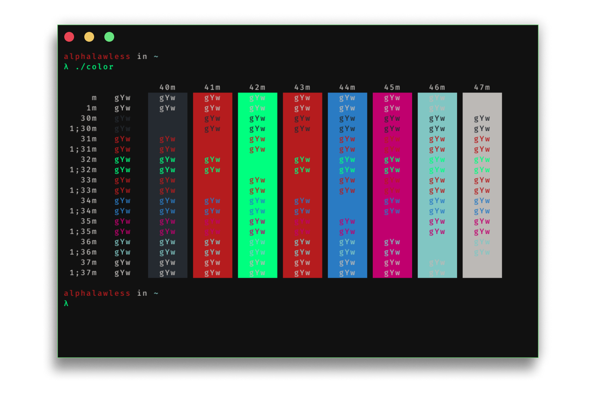

## Hydr Theme for [Kitty](https://sw.kovidgoyal.net/kitty/)

<p align="center">
  
</p>

This theme was inspired by the Hydr Theme that was first created for [VSCODE](https://github.com/ArthurHydr/hydr-theme).

## Credits

The creater is called [Arthur Ottoni (ArthurHydr)](https://github.com/arthurhydr/), and I thank him for letting me redesign the theme for kitty terminal.

## Install

In terminal copy and paste the following steps:
```sh
git clone https://github.com/alphalawless/hydrtheme-kitty
cd hydrtheme-kitty
mv ~/.config/kitty ~/.config/kitty.bkp
mkdir ~/.config/kitty/
mv *.conf ~/.conf/kitty/
```

## License

[GNU License](./LICENSE)
